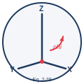

<p align="center">
  
</p>

<h1 align="center">SVY 326 -- Equation 2-28: 3D Coordinate Rotation Sweep</h1>

<p align="center">
  
  <a href="LICENSE"></a>
  
  <a href="https://google.github.io/styleguide/pyguide.html"></a>
  
  
</p>

A clean, professional Python implementation of Equation 2-28 from the SVY 326 (Geodesy and Surveying) coursework.  The equation describes a composite 3D rotation that transforms a coordinate vector from the HA (horizon-astronomic) frame to the H (horizon) frame via a constant 180-degree rotation about the Z-axis followed by a rotation of (90 - phi) degrees about the Y-axis.  The project sweeps the angle parameter phi from 0 to 360 degrees, visualises the results in four publication-quality plots, and includes a full suite of unit tests.

## Table of Contents

- [Overview](#overview)
- [Equation](#equation)
- [Project Structure](#project-structure)
- [Installation](#installation)
- [Usage](#usage)
- [Testing](#testing)
- [Output](#output)
- [Sample Results](#sample-results)
- [Contributing](#contributing)
- [How to Cite](#how-to-cite)
- [Acknowledgments](#acknowledgments)
- [License](#license)
- [Author](#author)

## Overview

In geodesy and surveying, coordinate frames must be rotated to align with different reference systems.  Equation 2-28 performs this transformation through two successive rotations:

1. **Rz(180 degrees)** -- A constant rotation of 180 degrees about the Z-axis (first factor applied to the vector).
2. **Ry(90 - phi degrees)** -- A rotation about the Y-axis by an angle that depends on the parameter phi (second factor applied).

The product Rz(180) * Ry(90 - phi) is orthogonal (det = 1) and therefore represents a proper rotation -- no scaling, shearing, or reflection is introduced.

## Equation

```
[X]     [-1  0  0]   [ cos(90-phi)   0   -sin(90-phi) ]   [X]
[Y]  =  [ 0 -1  0] * [      0        1        0       ] * [Y]
[Z]_H   [ 0  0  1]   [ sin(90-phi)   0    cos(90-phi) ]   [Z]_HA
```

Where:

- **phi** is the variable angle parameter (swept from 0 to 360 degrees in 15-degree steps).
- The left-hand vector is in the H frame (horizon).
- The right-hand vector is in the HA frame (horizon-astronomic).
- All trigonometric functions receive arguments converted to radians.

## Project Structure

```text
.
├── .gitignore
├── LICENSE
├── README.md
├── requirements.txt
├── SECURITY.md
├── pyproject.toml
├── main.py
├── .github/
│   ├── CODE_OF_CONDUCT.md
│   ├── PULL_REQUEST_TEMPLATE.md
│   ├── ISSUE_TEMPLATE/
│   │   ├── bug_report.md
│   │   └── feature_request.md
│   └── workflows/
│       └── ci.yml
├── src/
│   ├── __init__.py
│   ├── rotation_matrices.py
│   ├── transform.py
│   └── visualize.py
├── tests/
│   ├── __init__.py
│   └── test_rotation.py
├── data/
│   └── results.txt
├── graphs/
│   ├── plot1_3d_path.png
│   ├── plot2_xyz_vs_phi_separate.png
│   ├── plot3_sine_cosine_comparison.png
│   └── plot4_xyz_overlay.png
└── assets/
    └── logo.svg
```

| Path | Description |
|------|-------------|
| `.gitignore` | Ignored file patterns |
| `LICENSE` | MIT license |
| `README.md` | Project documentation |
| `requirements.txt` | Python dependencies |
| `SECURITY.md` | Security policy and vulnerability reporting |
| `pyproject.toml` | Project config (ruff linter, pytest) |
| `main.py` | Entry point: runs the full pipeline |
| `.github/CODE_OF_CONDUCT.md` | Contributor Covenant v2.1 |
| `.github/PULL_REQUEST_TEMPLATE.md` | PR checklist and template |
| `.github/ISSUE_TEMPLATE/bug_report.md` | Bug report form |
| `.github/ISSUE_TEMPLATE/feature_request.md` | Feature request form |
| `.github/workflows/ci.yml` | GitHub Actions CI (test + lint) |
| `src/__init__.py` | Package initialiser |
| `src/rotation_matrices.py` | Rz(180), Ry(90-phi), and composite matrix |
| `src/transform.py` | Point transformation and angle sweep |
| `src/visualize.py` | Plotting routines (four figures) |
| `tests/test_rotation.py` | Pytest unit tests with known analytic values |
| `data/results.txt` | Formatted sweep results for all three test vectors |
| `graphs/plot1_3d_path.png` | 3D scatter / line of the rotated path |
| `graphs/plot2_xyz_vs_phi_separate.png` | X, Y, Z components vs phi (subplots) |
| `graphs/plot3_sine_cosine_comparison.png` | Continuous trig curves + discrete samples |
| `graphs/plot4_xyz_overlay.png` | X, Y, Z overlay on a single axes |
| `assets/logo.svg` | Geometric logo representing frame rotation |

## Installation

The virtual environment is already activated.  To install dependencies:

```bash
pip install -r requirements.txt
```

## Usage

Run the full pipeline from the project root:

```bash
python main.py
```

This will:

1. Print the composite matrix at phi = 0.
2. Sweep phi from 0 to 360 degrees at 15-degree increments for three test vectors.
3. Print formatted tables of results to the console.
4. Save formatted results for all three test vectors to `data/results.txt`.
5. Generate all four plots into the `graphs/` directory.

## Testing

Run the unit test suite with pytest:

```bash
pytest tests/ -v
```

Tests verify:

- Exact values of the constant Rz(180) matrix.
- Ry(90 - phi) at phi = 90 (identity) and phi = 0 (Ry(90)).
- Orthogonality (R^T * R = I) of the composite matrix at six phi values.
- Determinant = 1 (proper rotation) at six phi values.
- Analytic hand-check of the transform for unit vectors at phi = 0.
- Regression test: Z = -cos(phi) for transform_point(1,0,0,phi) at five phi values.

## Output

| File | Description |
|------|-------------|
| `data/results.txt` | Formatted plain-text results for all three test vectors. |
| `graphs/plot1_3d_path.png` | 3D path of the rotated vector through all 25 angle steps. |
| `graphs/plot2_xyz_vs_phi_separate.png` | Three stacked subplots of X, Y, Z vs phi. |
| `graphs/plot3_sine_cosine_comparison.png` | Continuous sin(90-phi) / cos(90-phi) curves with 15-degree sample markers. |
| `graphs/plot4_xyz_overlay.png` | X, Y, Z plotted together on a single 2D axes with legend. |

## Sample Results

Results for test vector (1, 0, 0)_HA swept from 0 to 45 degrees:

| Phi (deg) | X | Y | Z |
|-----------|---|---|---|
| 0.0 | 0.0000 | 0.0000 | -1.0000 |
| 15.0 | -0.2588 | 0.0000 | -0.9659 |
| 30.0 | -0.5000 | 0.0000 | -0.8660 |
| 45.0 | -0.7071 | 0.0000 | -0.7071 |

Note: The Y component remains zero for this particular test vector because the input vector (1, 0, 0) is orthogonal to the Y-axis and the composite rotation only introduces Y components for vectors with a non-zero Y input.  For the (1,0,0) test vector the analytic result is X = -sin(phi), Y = 0, Z = -cos(phi).

## Contributing

Contributions are welcome.  Please see [`CONTRIBUTING.md`](#contributing) below
for the full workflow.  In short:

1. Fork the repository.
2. Create a feature branch (`git checkout -b feature/my-change`).
3. Install the dev environment (`pip install -r requirements.txt`).
4. Run the existing tests and linter to confirm a clean baseline
   (`pytest tests/ -v && ruff check .`).
5. Make your changes, keeping code and documentation emoji-free.
6. Run the full test suite and linter again; confirm all pass.
7. Commit, push, and open a pull request using
   [the pull-request template](.github/PULL_REQUEST_TEMPLATE.md).

This project follows the [Google Python Style Guide](https://google.github.io/styleguide/pyguide.html)
and uses [ruff](https://docs.astral.sh/ruff/) for linting.  All
contributors are expected to adhere to the
[Code of Conduct](.github/CODE_OF_CONDUCT.md).

## How to Cite

If you reference this implementation in academic or professional work:

> Bolatito, M. O. (2026). SVY 326 -- Equation 2-28: 3D Coordinate Rotation
> Sweep (Version 1.0). GitHub. https://github.com/opeblow/SVY_326

## Acknowledgments

This project was developed as part of the SVY 326 (Geodesy and Surveying)
coursework.  It implements Equation 2-28 from the course curriculum, which
describes a composite 3D rotation transforming coordinates from the HA
(horizon-astronomic) frame to the H (horizon) frame.  The implementation
was built with NumPy for matrix computation, Matplotlib for visualisation,
and pytest for unit testing.

## License

Distributed under the MIT License.  See `LICENSE` for more information.

## Author

**MOBOLAJI OPEYEMI BOLATITO** -- SVY 326 -- Geodesy and Surveying.
